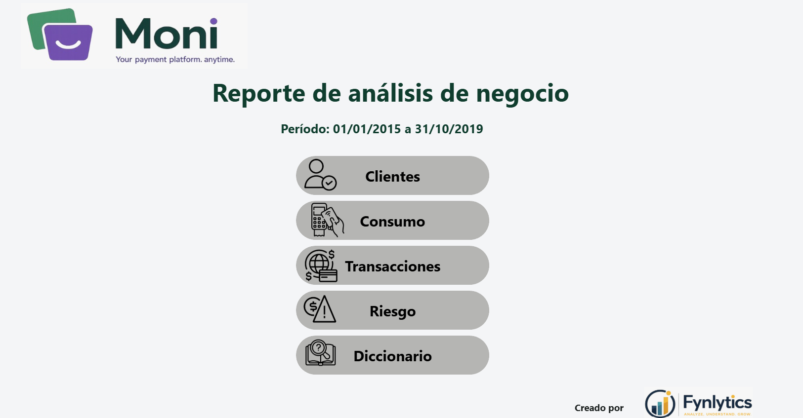
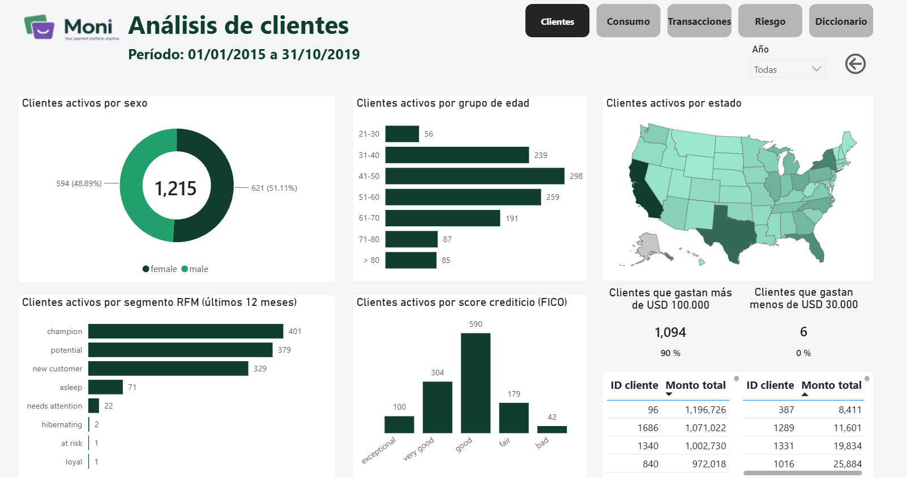
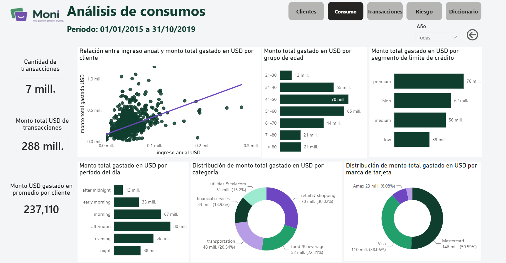
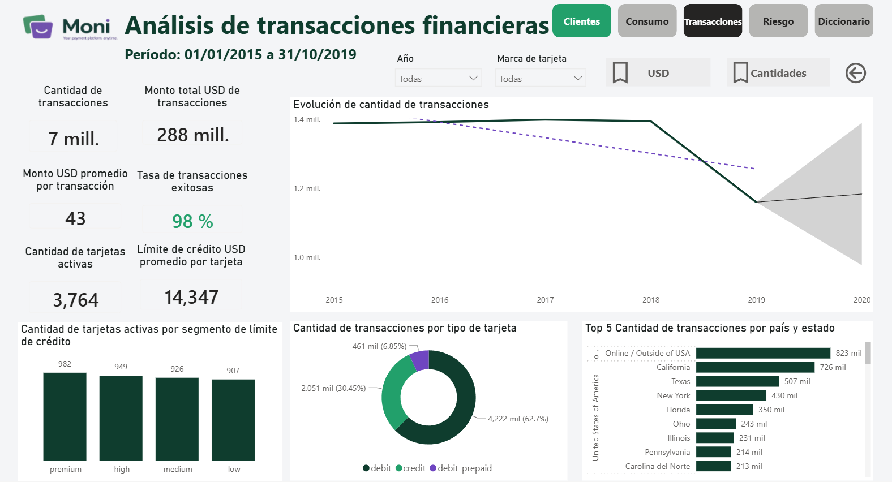
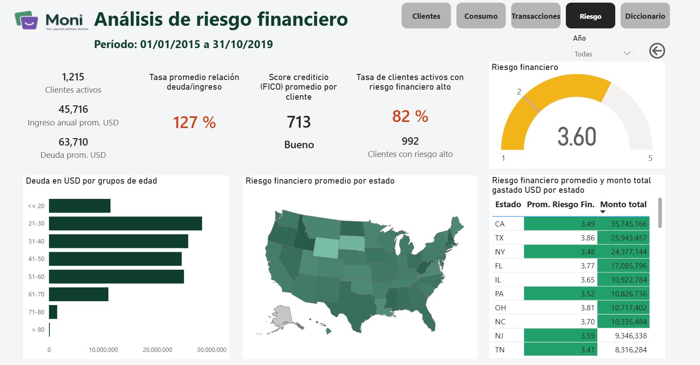
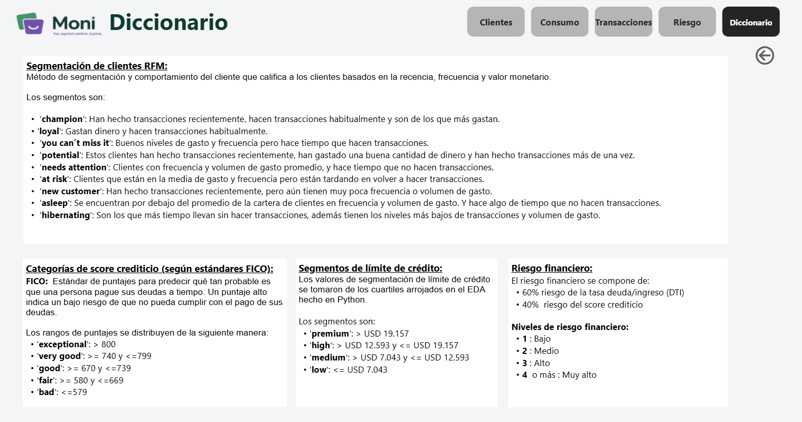

# Moni — Financial Transactions Analytics Pipeline

An end-to-end data analytics project: raw financial transaction data is extracted and cleaned in **Python**, modeled into a relational star schema in **MySQL**, and visualized in an interactive **Power BI** dashboard for spending behavior, credit risk, and customer segmentation analysis.

Built as the capstone integration project for a Full Data Analyst certification (SQL, Python, Power BI, Cloud fundamentals).

## Overview

The project answers a simple business question: *how do customers spend, and how risky are they?* It takes a raw, denormalized Kaggle dataset of credit card transactions and turns it into a governed data model that a BI dashboard can query directly, with segments and risk scores pre-computed for analysis.

**Pipeline:** Kaggle (raw JSON/CSV) → Python/pandas ETL → MySQL (star schema + views) → Power BI (dashboard)

```
┌──────────────┐     ┌─────────────────┐     ┌────────────────────┐     ┌──────────────────┐
│   Kaggle     │ --> │  Python / pandas │ --> │   MySQL Workbench   │ --> │     Power BI       │
│ raw datasets │     │   ETL notebooks  │     │  star-schema tables │     │  interactive       │
│ (4 sources)  │     │  clean + model   │     │     + SQL views      │     │  dashboard (2 pgs) │
└──────────────┘     └─────────────────┘     └────────────────────┘     └──────────────────┘
```

## Data source

[Transactions Fraud Datasets](https://www.kaggle.com/datasets/computingvictor/transactions-fraud-datasets) (Kaggle, `computingvictor`), pulled programmatically with `kagglehub`:

| Raw file | Records | Description |
|---|---|---|
| `users_data.csv` | 2,000 | Client demographics, income, debt, credit score |
| `cards_data.csv` | 6,416 | Card brand/type, credit limit, chip status |
| `transactions_data.csv` | 13,305,915 | Individual card transactions, 2010–2019 |
| `mcc_codes.json` | 109 | Merchant Category Codes (merchant type lookup) |

## Tech stack

- **Python** (pandas, numpy, matplotlib/seaborn, plotly, sqlalchemy, kagglehub, reverse_geocoder) — extraction, cleaning, EDA
- **MySQL / MySQL Workbench** — relational storage, star-schema modeling, SQL views
- **Power BI** — data modeling (calendar/time dimensions, DAX measures), dashboard design
- **Cloud fundamentals** — dataset sourced and pulled via API rather than manual download, environment-variable-based credential management (`.env` + `python-dotenv`) instead of hardcoded secrets

## ETL process (Python)

Each raw source has its own notebook. All follow the same pattern: load raw data → validate/clean → engineer features → split into normalized dimension/fact tables → export clean CSVs → EDA with documented conclusions.

### 1. `1_ETL_mcc.ipynb` — Merchant Category Codes
- Converts `mcc_code` to int, and builds a rule-based classifier (`categorize_mcc()`) that buckets all 109 raw merchant descriptions into 12 human-readable categories (Food & Beverage, Retail & Shopping, Healthcare, etc.) by keyword matching.
- Splits the result into two normalized tables: `mcc` (code, name, FK to category) and `mcc_category` (lookup).
- **Finding:** Retail & Shopping and Industrial & Manufacturing have the most merchant codes; Financial Services and Digital & Subscriptions have the fewest.

### 2. `2_ETL_card.ipynb` — Cards
- Cleans 6,416 card records: validates card number length (15/16 digits), CVV length, strips `$` from `credit_limit` and casts to float, parses date fields, lowercases boolean/flag fields.
- Encodes `card_brand` and `card_type` into their own dimension tables via `pd.factorize`.
- **Business logic — credit limit segmentation** (thresholds derived from the EDA quartiles):

  | Segment | Range (USD) |
  |---|---|
  | low | ≤ 10,000 |
  | medium | 10,000 – 20,000 |
  | high | 20,000 – 40,000 |
  | premium | 40,000 – 80,000 |
  | ultra | > 80,000 |

- **Findings:** Mastercard and Visa carry the highest average credit limits (~$14,000); debit cards have higher limits than credit cards (bank balance vs. issuer-approved spend); over 70% of cards fall in the low/medium tiers; zero cards flagged on the dark web.

### 3. `3_ETL_transactions.ipynb` — Transactions (the largest and most involved notebook)
- Filters 13.3M rows down to the last 5 years (2015–2019) per project scope.
- Splits `date` into `date_tx`/`time_tx` and derives `calendar_id`/`time_id` surrogate keys to link to Power BI date/time dimension tables.
- Cleans `use_chip` → `transaction_type` (chip / swipe / online), and merchant location fields into normalized `city`, `country`, and `state_usa` dimension tables (handling online transactions and non-US merchants as explicit categories rather than nulls).
- Normalizes the `errors` column (a transaction can have multiple errors) into a **many-to-many junction table** (`transactions_error_type`) linking transactions to an `error_type` lookup, and derives a simple `status_transaction` success flag.
- Resolves a 13%-null `zip` field by tracing the nulls to international/online transactions and backfilling with the industry-standard `00000` placeholder.
- **Business logic — transaction amount segmentation:** bucketed into `amount_usd_group` bands (≤9, 10–29, 30–63, >63) using EDA-derived quartiles for use as a Power BI slicer/dimension.
- **Findings:** 98%+ of transactions succeed; top merchant categories by volume are supermarkets, food stores, gas stations, restaurants, and pharmacies; most activity happens in the afternoon; 87% of transactions are at US merchants, with the remainder split between online and international purchases.

### 4. `4_ETL_users.ipynb` — Users
- Converts income/debt fields from string to numeric, drops a redundant `current_age` (recomputed later from `birth_year`).
- Reverse-geocodes each client's lat/long (`reverse_geocoder`) into city/state/country, then reconciles new locations against the transactions notebook's draft location tables — appending 187 new cities that didn't already exist and finalizing those dimension tables.
- **Business logic — age, debt, and credit-risk scoring**, built directly into the SQL view (see below): age bands in 10-year buckets, debt-to-income ratio, debt-level tiers (no debt / low / medium / high from EDA quartiles), a 1–5 debt-risk score, and a 1–5 credit-risk score mapped from FICO credit-score bands.
- Investigates and documents a small anomaly (15 clients, 0.75% of the base) with implausibly low income, maps them geographically to rule out a regional data issue, and makes an explicit, documented decision to keep them rather than silently drop them.
- **Findings:** average client is 45 years old with a 710 credit score and ~$63.7K in debt; per-capita income correlates strongly with yearly income (r = 0.96); yearly income correlates moderately with total debt (r = 0.55); debt tends to decrease with age.

### 5. `5_ETL_conexion_python_con_mysql.ipynb` — Load to MySQL
- Loads all cleaned CSVs and inserts them into the `moni_clean` MySQL database via `sqlalchemy`, respecting FK order (lookup tables → tables with FKs → the 13M-row `transactions` table last, using MySQL's `LOAD DATA LOCAL INFILE` for performance instead of row-by-row inserts).
- Credentials are pulled from a `.env` file (never hardcoded), following basic cloud/security hygiene.
- Closes the loop with validation queries confirming every table loaded correctly.

## Data model & SQL views

`sql/moni_clean_DDL.sql` is the master script: it creates the `moni_clean` database, all 13 tables (fact table `transactions`; dimension tables `card`, `users`, `mcc`, `city`, `country`, `state_usa`, `card_brand`, `card_type`, `transaction_type`, `error_type`, `mcc_category`; junction table `transactions_error_type`), wires up every foreign key between them, and then defines the 5 production SQL views that Power BI actually connects to:

- **`vw_star_model_pbi_mcc`** — merchant category code joined to its category lookup.
- **`vw_star_model_pbi_card`** — card joined to brand/type, with the credit-limit segment (low/medium/high/premium) computed in SQL.
- **`vw_star_model_pbi_users`** — the richest view: joins users to their location dimensions and computes current age, age range + sort order, FICO category, debt-to-income ratio, debt level, a 1–5 debt-risk score, and a 1–5 credit-risk score — all in SQL, so Power BI can slice by any of these without DAX.
- **`vw_star_model_pbi_transactions`** — the fact table joined to transaction type, city, country, and state, plus the amount-band segment.
- **`vw_star_model_pbi_segment_rfm`** — customer segmentation using **RFM analysis** (Recency, Frequency, Monetary): a CTE computes each client's recency/frequency/monetary metrics over the trailing 12 months, scores each on a 1–3 scale (`NTILE(3)` for frequency/monetary, a recency bucket for recency), and maps the combined score to one of 9 named segments (`champion`, `loyal`, `potential`, `at risk`, `hibernating`, etc.) — a standard customer-value segmentation technique lifted straight from marketing analytics into this dashboard's "Clientes" page.

The `sql/` folder also keeps the individual view scripts (`vw_mcc.sql`, `vw_card.sql`, `vw_transactions_draft.sql`, `vw_users_draft_V2.sql`) from earlier in development — `moni_clean_DDL.sql` is the final, authoritative version that was actually used to build the database, including the RFM view that isn't in the drafts.

Power BI connects live to MySQL (`MySQL.Database`) in import mode and pulls these views directly, plus a separate calendar dimension table and a time-of-day dimension table (built with Power Query, bucketing each hour into after-midnight / early-morning / morning / afternoon / evening / night) — a proper star schema rather than one flat table.

## Power BI dashboard

Six pages (`moni.pbix`, not included in this repo — see note below):

**Portada (Cover)** — landing page with navigation buttons to every other page. 

**Clientes (Customers)** — active client count; client mix by sex (donut) and by US state (shape map); clients by age range and by FICO category; **RFM segment breakdown** (champion/loyal/at risk/hibernating/etc.); a ranked client table by transaction volume; high-value (>$100K) and low-value (<$10K) client counts and rates; year slicer. 

**Consumo (Consumption)** — average spend per client; income-vs-spend scatter plot; spend by age range, by credit-limit segment, and by time of day; spend split by merchant category and by card brand (donuts); transaction count and total volume KPIs; year slicer. 

**Transacciones (Transactions)** — transaction count, total volume, average value, and success-rate KPIs; monthly trend lines (volume and count); transaction count and volume by country/state; active-cards KPI and card-type breakdown; average credit limit and card count by credit-limit segment; card-brand slicer. 

**Riesgo (Risk)** — average debt-to-income ratio; total debt by age range; average credit score and category; a **financial risk gauge** (a blended 1–5 score combining debt-to-income and credit-score risk, weighted 60/40); high-risk client count and rate; risk-by-state shape map and table; client count, average income, and average debt KPIs; year slicer. 

**Diccionario (Dictionary)** — a data-dictionary page explaining every metric and segment used across the dashboard, for anyone reviewing it without context. 

Every content page has consistent navigation buttons back to the cover and dictionary — built as a real multi-page BI product

## A note on the `.pbix` file

`moni_dashboard.pbix` is ~138 MB, over GitHub's 100 MB per-file limit for a normal push.

## Author

**Germán Valencia** — Data Analyst | SQL · Python · Power BI · Cloud Fundamentals
[LinkedIn](https://www.linkedin.com/in/german-valencia-74645458) · [Email](mailto:germancho06@gmail.com)
